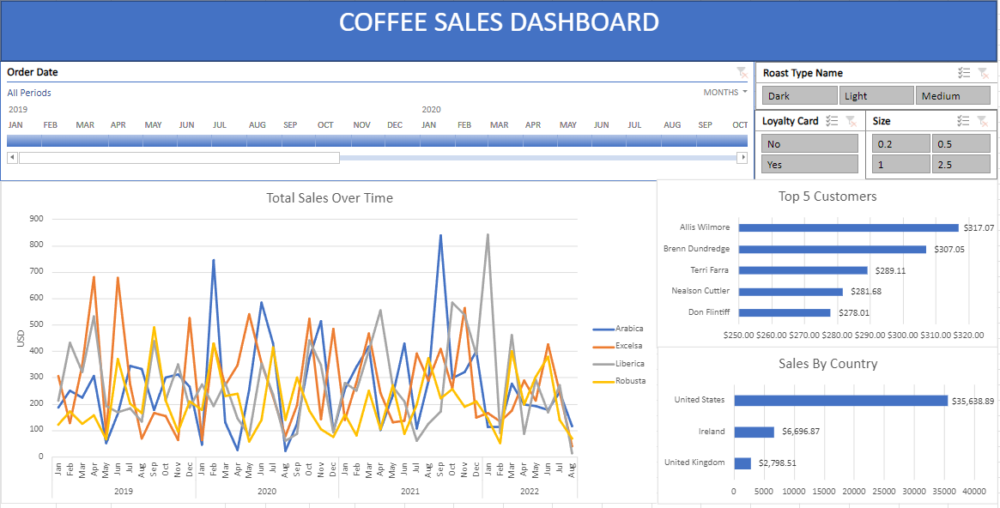

# Coffee Sales Analysis on Excel

Analyzing sales for an example coffee bean store dataset using Excel. To explore the interactive dashboard, download the Excel (.xlsx) file above!

## North Star Metrics & Dimensions
**Sales:** Total revenue generated from Arabica, Excelsa, Liberica, and Robusta coffee beans

**Loyalty Card:** Has a loyalty card or doesn't have a loyalty card

**Roast Type:** Dark, Medium, or Light roast

**Size:** 0.2 kg, 0.5 kg, 1 kg, or 2.5 kg

**Coffee Type:** Arabica, Excelsa, Liberica, and Robusta

## Summary of Insights
**Loyalty Card:** In Feb. 2020 and Sep. 2021, Sales of Arabica coffee showed large spikes among customers without a loyalty card. Outside of these spikes, sales among customers without a loyalty card seem to be about equal to sales from customers with loyalty cards.

**Size:** Very few sales of 1kg coffee bags among customers with loyalty cards.

**Sales:** Jan. 2022 saw a large spike in sales of Liberica beans with an unusually low amount of sales in other coffee bean types, with Liberica beans comprising over 70% of all sales for Jan. 2022. 

## Recommendations & Next Steps
- Investigate cause of spike of sales from non-loyalty card customers in Feb. 2020 and Sep. 2021 and see if they're anomalies or if its an issue worth looking into. Is it possible to convert these customers to loyalty card members?

- Consider running a promotion to increase sales of 1kg coffee bags among loyalty card members.

- Investigate sales distribution in Jan. 2022 and determine if something can be done to stabilize sales distribution.